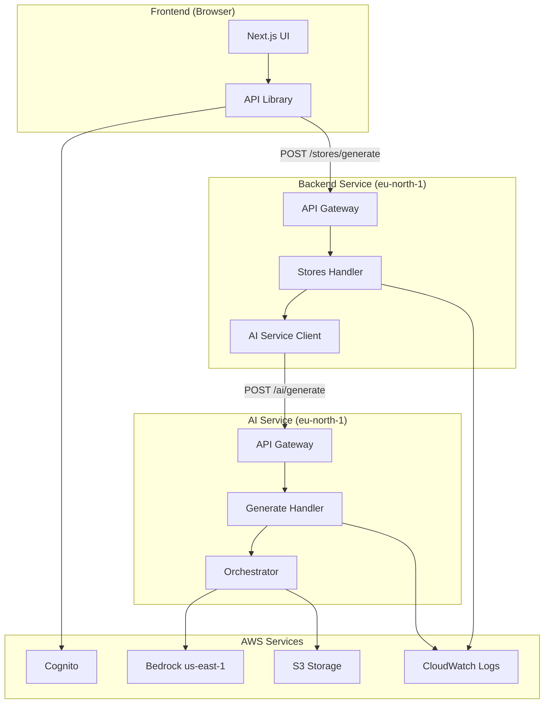

# Design Document: Fix AI Generation Functionality

## Overview

This design addresses the complete fix for the WebDPro AI generation functionality. The system consists of three main components: the AI Services Lambda functions (deployed in eu-north-1), the Backend API (which orchestrates store generation), and the Frontend (Next.js application). The current implementation has multiple issues preventing successful AI generation, including missing IAM permissions, incorrect API Gateway routing, improper Lambda response formats, and CORS configuration problems.

The fix involves updating the Serverless Framework configuration, implementing proper Lambda handler response formats, adding comprehensive error handling, configuring CORS correctly, and ensuring the frontend makes authenticated requests to the correct endpoints.

### Architecture Context

```
Frontend (Next.js)
    ↓ HTTP POST /stores/generate
Backend API (Lambda in eu-north-1)
    ↓ HTTP POST /ai/generate
AI Service API Gateway (eu-north-1)
    ↓ Lambda Proxy Integration
AI Service Lambda (eu-north-1)
    ↓ Bedrock API calls
AWS Bedrock (us-east-1)
```

### Key Issues Being Fixed

1. **IAM Permissions**: Lambda execution role lacks Bedrock permissions
2. **API Gateway Routes**: Route mismatch between frontend expectations and actual configuration
3. **Lambda Response Format**: Handlers not returning proper API Gateway proxy response format
4. **CORS**: Missing or incorrect CORS headers preventing browser requests
5. **Error Handling**: Insufficient error handling and logging
6. **Request Parsing**: Improper parsing of request body and validation

## Architecture

### Component Diagram



### Data Flow

1. **User Initiates Generation**: User fills form in Frontend and clicks "Generate Store"
2. **Frontend to Backend**: Frontend calls `POST /stores/generate` on Backend API with JWT token
3. **Backend to AI Service**: Backend extracts tenant ID, creates store record, calls AI Service
4. **AI Service Processing**: AI Service Lambda receives request, validates input, calls orchestrator
5. **Bedrock Generation**: Orchestrator calls Bedrock models in us-east-1 for spec, code, and images
6. **S3 Storage**: Generated assets stored in S3 buckets in eu-north-1
7. **Response Chain**: Success response flows back through AI Service → Backend → Frontend
8. **Error Handling**: Errors at any stage logged to CloudWatch and returned to user

## Components and Interfaces

### 1. Serverless Configuration (ai_services/serverless.yml)

**Purpose**: Define Lambda functions, API Gateway routes, IAM permissions, and AWS resources.

**Key Changes**:

```yaml
provider:
  iam:
    role:
      statements:
        # FIXED: Add Bedrock permissions
        - Effect: Allow
          Action:
            - bedrock:InvokeModel
            - bedrock:InvokeModelWithResponseStream
          Resource: 
            - "arn:aws:bedrock:us-east-1::foundation-model/*"

functions:
  generateWebsite:
    handler: src/handlers/generate.generateWebsite
    events:
      - http:
          path: /ai/generate
          method: post
          cors: true  # Simplified CORS config
          
  generateCode:
    handler: src/handlers/generate.generateCode
    events:
      - http:
          path: /ai/code
          method: post
          cors: true
          
  generateImages:
    handler: src/handlers/generate.generateImages
    events:
      - http:
          path: /ai/images
          method: post
          cors: true
```

**Interface**:
- Input: Serverless Framework deployment command
- Output: CloudFormation stack with Lambda functions, API Gateway, IAM roles

### 2. Lambda Handler (ai_services/src/handlers/generate.ts)

**Purpose**: Handle HTTP requests from API Gateway, validate input, call orchestrator, return responses.

**Current Issues**:
- Response format is correct but needs OPTIONS handling
- Error handling needs improvement
- Request validation could be more robust

**Fixed Implementation**:

```typescript
import { APIGatewayProxyEvent, APIGatewayProxyResult } from 'aws-lambda';
import { orchestrateSiteGeneration } from '../orchestrator';
import { UserInput } from '../schemas';

// Helper: Create standardized response
const createResponse = (
  statusCode: number, 
  body: any
): APIGatewayProxyResult => ({
  statusCode,
  headers: {
    'Content-Type': 'application/json',
    'Access-Control-Allow-Origin': '*',
    'Access-Control-Allow-Methods': 'GET,POST,PUT,DELETE,OPTIONS',
    'Access-Control-Allow-Headers': 'Content-Type,Authorization,X-Amz-Date,X-Api-Key,X-Amz-Security-Token',
    'Access-Control-Allow-Credentials': 'true',
  },
  body: JSON.stringify(body),
});

// Handle OPTIONS preflight requests
const handleOptions = (): APIGatewayProxyResult => {
  return createResponse(200, { message: 'CORS preflight successful' });
};

export const generateWebsite = async (
  event: APIGatewayProxyEvent
): Promise<APIGatewayProxyResult> => {
  // Handle OPTIONS preflight
  if (event.httpMethod === 'OPTIONS') {
    return handleOptions();
  }

  try {
    console.log('[Generate Website] Request received', {
      method: event.httpMethod,
      path: event.path,
      headers: event.headers,
    });

    // Parse and validate request body
    let body: any;
    try {
      body = JSON.parse(event.body || '{}');
    } catch (parseError) {
      console.error('[Generate Website] JSON parse error:', parseError);
      return createResponse(400, {
        error: 'Invalid JSON in request body',
      });
    }

    const { input, tenantId, storeId } = body;

    // Validate required fields
    if (!input) {
      return createResponse(400, {
        error: 'Missing required field: input',
      });
    }

    if (!tenantId) {
      return createResponse(400, {
        error: 'Missing required field: tenantId',
      });
    }

    if (!storeId) {
      return createResponse(400, {
        error: 'Missing required field: storeId',
      });
    }

    // Construct UserInput with defaults
    const userInput: UserInput = {
      businessName: input.businessName || 'My Business',
      businessType: input.businessType || 'general',
      location: input.location || 'India',
      description: input.description || input.prompt || '',
      language: input.language || 'en',
      themePreference: input.themePreference,
    };

    console.log('[Generate Website] Processing generation', {
      businessName: userInput.businessName,
      businessType: userInput.businessType,
      tenantId,
      storeId,
    });

    // Call orchestrator
    const startTime = Date.now();
    const result = await orchestrateSiteGeneration(
      userInput,
      tenantId,
      storeId
    );
    const duration = Date.now() - startTime;

    console.log('[Generate Website] Generation successful', {
      duration,
      websiteUrl: result.websiteUrl,
      sectionsGenerated: result.metadata?.sectionsGenerated,
      imagesGenerated: result.metadata?.imagesGenerated,
    });

    return createResponse(200, {
      success: true,
      data: result,
    });

  } catch (error) {
    console.error('[Generate Website] Error:', {
      error: error instanceof Error ? error.message : 'Unknown error',
      stack: error instanceof Error ? error.stack : undefined,
    });

    return createResponse(500, {
      error: 'Website generation failed',
      details: error instanceof Error ? error.message : 'Unknown error',
    });
  }
};

export const generateCode = async (
  event: APIGatewayProxyEvent
): Promise<APIGatewayProxyResult> => {
  if (event.httpMethod === 'OPTIONS') {
    return handleOptions();
  }

  try {
    console.log('[Generate Code] Request received');
    
    const body = JSON.parse(event.body || '{}');
    const { spec } = body;

    if (!spec) {
      return createResponse(400, { error: 'Missing required field: spec' });
    }

    // Import and call code generator
    const { generateCode: codeGen } = await import('../pipeline/2_code_generator');
    const result = await codeGen(spec);

    return createResponse(200, {
      success: true,
      data: result,
    });

  } catch (error) {
    console.error('[Generate Code] Error:', error);
    return createResponse(500, {
      error: 'Code generation failed',
      details: error instanceof Error ? error.message : 'Unknown error',
    });
  }
};

export const generateImages = async (
  event: APIGatewayProxyEvent
): Promise<APIGatewayProxyResult> => {
  if (event.httpMethod === 'OPTIONS') {
    return handleOptions();
  }

  try {
    console.log('[Generate Images] Request received');
    
    const body = JSON.parse(event.body || '{}');
    const { spec, tenantId, storeId } = body;

    if (!spec || !tenantId || !storeId) {
      return createResponse(400, {
        error: 'Missing required fields: spec, tenantId, storeId',
      });
    }

    // Import and call image generator
    const { generateImages: imgGen } = await import('../pipeline/3_image_generator');
    const result = await imgGen(spec, tenantId, storeId);

    return createResponse(200, {
      success: true,
      data: result,
    });

  } catch (error) {
    console.error('[Generate Images] Error:', error);
    return createResponse(500, {
      error: 'Image generation failed',
      details: error instanceof Error ? error.message : 'Unknown error',
    });
  }
};
```

**Interface**:
- Input: `APIGatewayProxyEvent` with body containing `{ input, tenantId, storeId }`
- Output: `APIGatewayProxyResult` with `{ statusCode, headers, body }`

### 3. Bedrock Client (ai_services/src/bedrock.ts)

**Purpose**: Provide a wrapper around AWS Bedrock SDK with retry logic and error handling.

**Key Requirements**:
- Use correct region (us-east-1)
- Handle both streaming and non-streaming responses
- Implement retry logic with fallback models
- Log all API calls and errors

**Implementation Notes**:
```typescript
import { BedrockRuntimeClient, InvokeModelCommand } from '@aws-sdk/client-bedrock-runtime';

const bedrockClient = new BedrockRuntimeClient({
  region: process.env.AWS_BEDROCK_REGION || 'us-east-1',
});

export async function invokeBedrockModel(
  modelId: string,
  prompt: string,
  maxTokens: number = 4096
): Promise<string> {
  try {
    console.log(`[Bedrock] Invoking model: ${modelId}`);
    
    const command = new InvokeModelCommand({
      modelId,
      contentType: 'application/json',
      accept: 'application/json',
      body: JSON.stringify({
        prompt,
        max_tokens: maxTokens,
        temperature: 0.7,
      }),
    });

    const response = await bedrockClient.send(command);
    const responseBody = JSON.parse(
      new TextDecoder().decode(response.body)
    );

    console.log(`[Bedrock] Model invocation successful`);
    return responseBody.completion || responseBody.content;

  } catch (error) {
    console.error(`[Bedrock] Model invocation failed:`, error);
    throw error;
  }
}
```

### 4. Frontend API Client (frontend/lib/api.ts)

**Purpose**: Provide typed API methods for calling backend services with authentication.

**Current Issues**:
- Missing Authorization header in AI service calls
- Error handling could be improved

**Fixed Implementation**:

```typescript
export const apiAI = {
  generateWebsite: async (data: {
    businessName: string;
    description?: string;
    themePreference?: string;
    tenantId: string;
    storeId: string;
  }) => {
    const token = localStorage.getItem("token");
    
    return fetchAPI<{ success: true; data: any }>(
      `${AI_BASE_URL}/ai/generate`,
      {
        method: "POST",
        headers: {
          'Content-Type': 'application/json',
          ...(token ? { 'Authorization': `Bearer ${token}` } : {}),
        },
        body: JSON.stringify({
          input: {
            businessName: data.businessName,
            description: data.description,
            themePreference: data.themePreference,
          },
          tenantId: data.tenantId,
          storeId: data.storeId,
        }),
      }
    );
  }
};
```

**Note**: The actual call flow is Frontend → Backend → AI Service, so the frontend doesn't directly call the AI service. The Backend's AI client handles the AI service calls.

### 5. Backend AI Client (backend/src/lib/ai-client.ts)

**Purpose**: HTTP client for Backend to call AI Service.

**Current Implementation**: Already correct, but needs error handling improvements.

**Enhanced Implementation**:

```typescript
export class AIServiceClient {
  private baseUrl: string;
  private maxRetries: number = 3;
  private retryDelay: number = 1000;

  constructor() {
    this.baseUrl = process.env.AI_SERVICE_URL || 
      'https://l0wi495th5.execute-api.eu-north-1.amazonaws.com/dev';
  }

  async generateWebsite(
    request: AIGenerationRequest
  ): Promise<AIGenerationResponse> {
    let lastError: Error | null = null;

    for (let attempt = 1; attempt <= this.maxRetries; attempt++) {
      try {
        console.log(
          `[AI Client] Attempt ${attempt}/${this.maxRetries}: ` +
          `Calling ${this.baseUrl}/ai/generate`
        );

        const response = await fetch(`${this.baseUrl}/ai/generate`, {
          method: 'POST',
          headers: {
            'Content-Type': 'application/json',
          },
          body: JSON.stringify(request),
        });

        const responseText = await response.text();
        
        if (!response.ok) {
          throw new Error(
            `AI service returned ${response.status}: ${responseText}`
          );
        }

        const result = JSON.parse(responseText);
        console.log('[AI Client] Generation successful');
        return result;

      } catch (error) {
        lastError = error instanceof Error ? error : new Error('Unknown error');
        console.error(
          `[AI Client] Attempt ${attempt} failed:`,
          lastError.message
        );

        if (attempt < this.maxRetries) {
          await new Promise(resolve => 
            setTimeout(resolve, this.retryDelay * attempt)
          );
        }
      }
    }

    console.error('[AI Client] All retry attempts failed');
    return {
      success: false,
      error: 'AI generation failed after retries',
      details: lastError?.message || 'Unknown error',
    };
  }
}
```

## Data Models

### Request Models

#### AIGenerationRequest
```typescript
interface AIGenerationRequest {
  input: {
    businessName: string;
    businessType: string;
    location?: string;
    description?: string;
    language?: string;
    themePreference?: string;
  };
  tenantId: string;
  storeId: string;
}
```

#### UserInput (Internal)
```typescript
interface UserInput {
  businessName: string;
  businessType: string;
  location: string;
  description: string;
  language: string;
  themePreference?: string;
}
```

### Response Models

#### APIGatewayProxyResult
```typescript
interface APIGatewayProxyResult {
  statusCode: number;
  headers: {
    'Content-Type': string;
    'Access-Control-Allow-Origin': string;
    'Access-Control-Allow-Methods': string;
    'Access-Control-Allow-Headers': string;
    'Access-Control-Allow-Credentials': string;
  };
  body: string; // JSON stringified
}
```

#### AIGenerationResponse
```typescript
interface AIGenerationResponse {
  success: boolean;
  data?: {
    html: string;
    css: string;
    images: Record<string, string>;
    config: any;
    websiteUrl: string;
    metadata: {
      generationTime: number;
      bedrockRegion: string;
      storageRegion: string;
      tenantId: string;
      storeId: string;
      sectionsGenerated: number;
      imagesGenerated: number;
      htmlSize: number;
    };
  };
  error?: string;
  details?: string;
}
```

### Error Response Model

```typescript
interface ErrorResponse {
  error: string;
  details?: string;
  statusCode?: number;
}
```


## Correctness Properties

A property is a characteristic or behavior that should hold true across all valid executions of a system—essentially, a formal statement about what the system should do. Properties serve as the bridge between human-readable specifications and machine-verifiable correctness guarantees.

### Property Reflection

After analyzing all acceptance criteria, I identified the following redundancies:
- Properties 3.2-3.5 all test CORS headers individually, but can be combined into a single comprehensive property
- Property 4.5 is redundant with the combined CORS property
- Property 5.4 is covered by property 5.3 (missing required fields)
- Properties 10.2 and 10.3 are covered by properties 6.1 and 6.4

The following properties represent the unique, non-redundant correctness guarantees:

### Property 1: OPTIONS Request Handling

*For any* Lambda handler function and any OPTIONS HTTP request, the handler should return status code 200 with all required CORS headers (Access-Control-Allow-Origin, Access-Control-Allow-Methods, Access-Control-Allow-Headers, Access-Control-Allow-Credentials).

**Validates: Requirements 2.4, 3.1**

### Property 2: CORS Headers on All Responses

*For any* Lambda handler function and any HTTP request (GET, POST, PUT, DELETE, OPTIONS), the response should include all required CORS headers with correct values: Access-Control-Allow-Origin set to '*', Access-Control-Allow-Methods including all HTTP methods, Access-Control-Allow-Headers including required headers, and Access-Control-Allow-Credentials set to 'true'.

**Validates: Requirements 3.2, 3.3, 3.4, 3.5, 4.5**

### Property 3: Response Structure Validity

*For any* Lambda handler execution (successful or failed), the returned object should have the required properties: statusCode (number), headers (object), and body (string), matching the APIGatewayProxyResult interface.

**Validates: Requirements 4.1**

### Property 4: Valid HTTP Status Codes

*For any* Lambda handler response, the statusCode should be a valid HTTP status code in the range 100-599, with successful operations returning 2xx codes and errors returning 4xx or 5xx codes.

**Validates: Requirements 4.2**

### Property 5: JSON Response Body

*For any* Lambda handler response that includes data, the body property should be a valid JSON string that can be parsed without errors.

**Validates: Requirements 4.3**

### Property 6: Error Response Format

*For any* Lambda handler execution that encounters an error, the response should have statusCode 500 (or appropriate 4xx for client errors) and the parsed body should contain an 'error' property with a descriptive message.

**Validates: Requirements 4.4**

### Property 7: JSON Parsing Robustness

*For any* valid JSON string in the request body, the Lambda handler should successfully parse it; for any invalid JSON string, the handler should return statusCode 400 with an error message without throwing an unhandled exception.

**Validates: Requirements 5.1, 5.2**

### Property 8: Required Field Validation

*For any* request to the generateWebsite handler, if any required field (input, tenantId, storeId) is missing or null, the handler should return statusCode 400 with a descriptive error message indicating which field is missing.

**Validates: Requirements 5.3, 5.4**

### Property 9: Nested Property Extraction

*For any* valid request with nested input properties, the Lambda handler should correctly extract all nested properties (businessName, businessType, description, location, language, themePreference) and use default values for missing optional properties.

**Validates: Requirements 5.5**

### Property 10: Structured Logging Format

*For any* log message generated by the Lambda function, the message should include a consistent prefix (e.g., '[Generate Website]', '[Bedrock]') to enable filtering and should include relevant context (timestamp, request ID, operation).

**Validates: Requirements 6.5**

### Property 11: Bedrock Fallback Retry

*For any* Bedrock model invocation that fails, the system should attempt the next fallback model in the configured sequence, and only return an error after all fallback models have been exhausted.

**Validates: Requirements 7.3**

### Property 12: Frontend Authorization Header

*For any* authenticated API request from the frontend, if a valid JWT token exists in localStorage, the request should include an Authorization header with the format 'Bearer {token}'.

**Validates: Requirements 8.1**

### Property 13: Frontend Response Parsing

*For any* successful API response (statusCode 2xx), the frontend should correctly parse the response body and extract the expected data fields without errors.

**Validates: Requirements 8.4**

### Property 14: Token Tenant ID Extraction

*For any* valid JWT token containing a 'custom:tenant_id' or 'sub' claim, the Lambda handler should successfully extract the tenant ID; for tokens without these claims, the handler should return statusCode 401.

**Validates: Requirements 9.3**

## Error Handling

### Error Categories

1. **Client Errors (4xx)**
   - 400 Bad Request: Invalid JSON, missing required fields, invalid input format
   - 401 Unauthorized: Missing or invalid authentication token
   - 404 Not Found: Resource not found (if applicable)

2. **Server Errors (5xx)**
   - 500 Internal Server Error: Unexpected errors, Bedrock API failures, orchestration failures
   - 503 Service Unavailable: Bedrock service temporarily unavailable

### Error Response Format

All errors should follow this consistent format:

```typescript
{
  error: string;        // Human-readable error message
  details?: string;     // Technical details (stack trace in dev, sanitized in prod)
  statusCode?: number;  // HTTP status code
}
```

### Error Handling Strategy

1. **Input Validation Errors**: Return immediately with 400 status and descriptive message
2. **Authentication Errors**: Return immediately with 401 status
3. **Bedrock API Errors**: Log error, attempt fallback models, return 500 if all fail
4. **Orchestration Errors**: Log full error with context, return 500 with sanitized message
5. **Unexpected Errors**: Catch all unhandled exceptions, log with stack trace, return 500

### Logging Strategy

All errors should be logged to CloudWatch with:
- Error message and stack trace
- Request context (tenantId, storeId, businessName)
- Timestamp and request ID
- Current step in the generation pipeline
- Model being used (for Bedrock errors)

### Retry Logic

- **Bedrock API calls**: Retry with fallback models (up to 3 fallback models)
- **HTTP requests**: Retry up to 3 times with exponential backoff (1s, 2s, 4s)
- **No retry**: Input validation errors, authentication errors

## Testing Strategy

### Dual Testing Approach

This feature requires both unit tests and property-based tests to ensure comprehensive coverage:

- **Unit tests**: Verify specific examples, edge cases, and integration points
- **Property tests**: Verify universal properties across all inputs

### Unit Testing Focus

Unit tests should cover:

1. **Specific Examples**:
   - Valid request with all fields returns 200
   - Request with missing tenantId returns 400
   - Invalid JSON returns 400
   - OPTIONS request returns 200 with CORS headers

2. **Edge Cases**:
   - Empty string values for required fields
   - Very long input strings
   - Special characters in business names
   - Null vs undefined for optional fields

3. **Integration Points**:
   - Backend to AI Service communication
   - AI Service to Bedrock communication
   - S3 upload operations
   - CloudWatch logging

4. **Error Conditions**:
   - Bedrock API returns error
   - S3 upload fails
   - Network timeout
   - Invalid response from orchestrator

### Property-Based Testing Configuration

**Testing Library**: Use `fast-check` for TypeScript/JavaScript property-based testing

**Configuration**:
- Minimum 100 iterations per property test
- Each test must reference its design document property
- Tag format: `Feature: fix-ai-generation, Property {number}: {property_text}`

**Property Test Examples**:

```typescript
import fc from 'fast-check';

// Property 2: CORS Headers on All Responses
// Feature: fix-ai-generation, Property 2: CORS Headers on All Responses
test('all responses include required CORS headers', async () => {
  await fc.assert(
    fc.asyncProperty(
      fc.record({
        httpMethod: fc.constantFrom('GET', 'POST', 'PUT', 'DELETE', 'OPTIONS'),
        body: fc.option(fc.jsonValue(), { nil: null }),
      }),
      async (event) => {
        const response = await generateWebsite(event as any);
        
        expect(response.headers).toHaveProperty('Access-Control-Allow-Origin', '*');
        expect(response.headers).toHaveProperty('Access-Control-Allow-Methods');
        expect(response.headers['Access-Control-Allow-Methods']).toContain('POST');
        expect(response.headers).toHaveProperty('Access-Control-Allow-Headers');
        expect(response.headers).toHaveProperty('Access-Control-Allow-Credentials');
      }
    ),
    { numRuns: 100 }
  );
});

// Property 8: Required Field Validation
// Feature: fix-ai-generation, Property 8: Required Field Validation
test('missing required fields return 400 error', async () => {
  await fc.assert(
    fc.asyncProperty(
      fc.record({
        input: fc.option(fc.object(), { nil: null }),
        tenantId: fc.option(fc.string(), { nil: null }),
        storeId: fc.option(fc.string(), { nil: null }),
      }).filter(body => !body.input || !body.tenantId || !body.storeId),
      async (body) => {
        const event = {
          httpMethod: 'POST',
          body: JSON.stringify(body),
        };
        
        const response = await generateWebsite(event as any);
        
        expect(response.statusCode).toBe(400);
        const parsedBody = JSON.parse(response.body);
        expect(parsedBody).toHaveProperty('error');
        expect(parsedBody.error).toMatch(/missing|required/i);
      }
    ),
    { numRuns: 100 }
  );
});
```

### Test Organization

```
ai_services/
  src/
    handlers/
      generate.ts
      generate.test.ts          # Unit tests
      generate.property.test.ts # Property-based tests
    pipeline/
      1_spec_generator.test.ts
      2_code_generator.test.ts
      3_image_generator.test.ts
    bedrock.test.ts
    orchestrator.test.ts
```

### Integration Testing

Integration tests should verify:

1. **End-to-End Flow**: Frontend → Backend → AI Service → Bedrock → S3
2. **API Gateway Routing**: Requests reach correct Lambda handlers
3. **IAM Permissions**: Lambda can invoke Bedrock without errors
4. **CORS**: Browser can make requests without CORS errors
5. **Authentication**: Cognito tokens are validated correctly

### Manual Testing Checklist

After deployment, manually verify:

- [ ] Frontend can load the generate page
- [ ] Clicking "Generate Store" shows loading state
- [ ] Request appears in CloudWatch logs for AI Service Lambda
- [ ] Bedrock API is invoked (check CloudWatch logs)
- [ ] Generated website is stored in S3
- [ ] Success response is returned to frontend
- [ ] Error cases display user-friendly messages
- [ ] CORS headers are present in browser network tab
- [ ] Authentication token is included in requests
