# WebDPro AI - System Design Document

## 📋 Table of Contents

- [Document Purpose](#document-purpose)
1. [Architecture Overview](#1-architecture-overview)
   - [High-Level Architecture](#11-high-level-architecture)
   - [AI-First Architecture Pattern](#12-ai-first-architecture-pattern)
2. [AI Generation System Design](#2-ai-generation-system-design)
   - [5-Level AI Fallback Architecture](#21-5-level-ai-fallback-architecture)
   - [Sector-Specific Generation Logic](#22-sector-specific-generation-logic)
   - [Real-Time Content Generation Pipeline](#23-real-time-content-generation-pipeline)
3. [Multi-Tenant Data Architecture](#3-multi-tenant-data-architecture)
   - [DynamoDB Multi-Tenant Design](#31-dynamodb-multi-tenant-design)
   - [Global Secondary Indexes (GSI) Strategy](#32-global-secondary-indexes-gsi-strategy)
4. [Service Architecture](#4-service-architecture)
   - [Frontend Layer](#41-frontend-layer)
   - [Backend Services](#42-backend-services)
   - [Event-Driven Communication](#43-event-driven-communication)
5. [Security Architecture](#5-security-architecture)
   - [Authentication & Authorization](#51-authentication--authorization)
   - [Data Security](#52-data-security)
   - [API Security](#53-api-security)
6. [Performance Architecture](#6-performance-architecture)
   - [Scalability Design](#61-scalability-design)
   - [Caching Strategy](#62-caching-strategy)
   - [Database Optimization](#63-database-optimization)
7. [Monitoring & Observability](#7-monitoring--observability)
   - [Logging Strategy](#71-logging-strategy)
   - [Metrics & Alerting](#72-metrics--alerting)
   - [Distributed Tracing](#73-distributed-tracing)
8. [Deployment Architecture](#8-deployment-architecture)
   - [Infrastructure as Code](#81-infrastructure-as-code)
   - [CI/CD Pipeline](#82-cicd-pipeline)
9. [Disaster Recovery](#9-disaster-recovery)
   - [Backup Strategy](#91-backup-strategy)
   - [Recovery Procedures](#92-recovery-procedures)
10. [Cost Optimization](#10-cost-optimization)
    - [Resource Optimization](#101-resource-optimization)
    - [Cost Monitoring](#102-cost-monitoring)
11. [Future Architecture Considerations](#11-future-architecture-considerations)
    - [Scalability Enhancements](#111-scalability-enhancements)
    - [Technology Evolution](#112-technology-evolution)

---

## Document Purpose

**🏆 AI for Bharat 2026 - Retail & E-commerce Track Submission**

This document presents the complete system architecture for **WebDPro AI**, showcasing how artificial intelligence can revolutionize e-commerce accessibility in India through innovative technical design.

**Architectural Innovation Highlights:**
- **🧠 AI-First Architecture**: Revolutionary 5-level AI fallback system using AWS Bedrock with multi-model orchestration ensuring 100% website generation success rate.
- **🇮🇳 India-Scale Infrastructure**: Serverless architecture supporting 10M+ concurrent users with AWS-native services optimized for Indian traffic patterns and cost constraints.
- **🔒 Multi-Tenant Security**: Database-level isolation, enterprise-grade security patterns, and role-based access control ensuring complete data protection.
- **⚡ Event-Driven Ecosystem**: Real-time inventory management, delivery tracking, and payment processing using SNS/SQS messaging for seamless user experience.
- **💰 Future-Proof Design**: 5-7 year sustainable architecture with clear technology evolution pathways, cost optimization strategies, and scalability enhancements.

---

## 1. Architecture Overview

### 1.1 High-Level Architecture

**🏆 Challenge Track**: Retail & E-commerce - Revolutionary AI-driven platform architecture enabling instant e-commerce website generation and management for India's 63 million MSMEs.

**🎯 Core Innovation**: 5-Level AI Fallback System ensuring 100% generation success rate while optimizing costs through intelligent model selection.

```mermaid
graph TB
    subgraph "🇮🇳 India-Scale User Layer (10M+ Users)"
        BIZ[👤 Business Owner<br/>📱 Mobile-First Dashboard<br/>webdpro.ai]
        CUST[👤 Customer<br/>🛒 Generated Stores<br/>store.webdpro.in]
        AGENT[👤 Delivery Agent<br/>🏍️ GPS Tracking App<br/>Cash Collection]
        ADMIN[👤 Super Admin<br/>📊 Analytics Dashboard<br/>Revenue Monitoring]
    end
    
    subgraph "⚡ Edge & CDN Layer (Sub-2s Load Times)"
        CDN[🌍 CloudFront CDN<br/>🇮🇳 Mumbai Edge Locations<br/>Smart Caching]
        WEB[⚛️ Next.js 14 App<br/>🔄 Server Components<br/>Real-time Updates]
    end
    
    subgraph "🔐 Security & API Gateway"
        APIGW[🔀 API Gateway<br/>🚦 Rate Limiting: 1000/min<br/>CORS + Throttling]
        AUTH[🔐 Cognito + OTP<br/>📱 SMS via AWS SNS<br/>JWT + Multi-Role]
    end
    
    subgraph "🧠 AI Generation Engine (5-Level Fallback)"
        AI_ORCH[🎯 AI Orchestrator<br/>⚡ Smart Model Selection<br/>Cost Optimization]
        
        subgraph "AI Models (Ordered by Quality & Cost)"
            L1[🥇 Claude 3 Sonnet<br/>💰 $0.003/1K tokens<br/>🎯 Premium Quality]
            L2[🥈 Claude 3 Haiku<br/>💰 $0.00025/1K tokens<br/>⚡ Fast Generation]
            L3[🥉 Amazon Titan<br/>💰 $0.0008/1K tokens<br/>🏢 AWS Native]
            L4[🦙 Meta Llama 2<br/>💰 $0.00195/1K tokens<br/>🔓 Open Source]
            L5[⚡ Rule-Based<br/>💰 $0 cost<br/>✅ Never Fails]
        end
    end
    
    subgraph "🏢 Microservices Architecture (Event-Driven)"
        BACKEND[🏢 Backend Service<br/>🏪 Store Management<br/>👥 User Management]
        INVENTORY[📦 Inventory Service<br/>🤖 AI Stock Predictions<br/>📊 Real-time Updates]
        DELIVERY[🚚 Delivery Service<br/>📍 GPS Tracking<br/>💵 COD Management]
        PAYMENTS[💳 Payment Service<br/>🇮🇳 UPI + Razorpay<br/>💰 Auto-settlements]
    end
    
    subgraph "📊 Multi-Tenant Data Layer (Complete Isolation)"
        DDB[📊 DynamoDB<br/>🔒 7 Multi-Tenant Tables<br/>⚡ DAX Caching]
        S3[📁 S3 Buckets<br/>🌐 Generated Websites<br/>🖼️ AI Images + Assets]
        CACHE[⚡ DynamoDB DAX<br/>⏱️ Microsecond Latency<br/>🔄 Auto-invalidation]
    end
    
    subgraph "📡 Event-Driven Communication"
        SNS[📡 SNS Topics<br/>🔄 Real-time Events<br/>📊 System Coordination]
        SQS[📬 SQS Queues<br/>⚡ Async Processing<br/>🔄 Retry Logic]
    end
    
    subgraph "🇮🇳 India-Specific Integrations"
        RAZORPAY[💳 Razorpay Complete<br/>🇮🇳 UPI + Cards + COD<br/>💰 Instant Settlements]
        HOSTINGER[🌐 Hostinger Domains<br/>🔍 Real-time Availability<br/>⚡ Auto DNS Setup]
        SMS[📲 AWS SNS India<br/>📱 OTP Delivery<br/>📧 Email Notifications]
    end
    
    %% User Flow Connections
    BIZ --> WEB
    CUST --> WEB
    AGENT --> WEB
    ADMIN --> WEB
    
    %% Frontend to Backend
    WEB --> CDN
    CDN --> APIGW
    APIGW --> AUTH
    
    %% API Gateway to Services
    APIGW --> BACKEND
    APIGW --> AI_ORCH
    APIGW --> INVENTORY
    APIGW --> DELIVERY
    APIGW --> PAYMENTS
    
    %% AI Fallback Chain
    AI_ORCH --> L1
    L1 -.->|Fail/Timeout| L2
    L2 -.->|Fail/Timeout| L3
    L3 -.->|Fail/Timeout| L4
    L4 -.->|Fail/Timeout| L5
    L1 --> S3
    L2 --> S3
    L3 --> S3
    L4 --> S3
    L5 --> S3
    
    %% Data Layer Connections
    BACKEND --> DDB
    INVENTORY --> DDB
    DELIVERY --> DDB
    PAYMENTS --> DDB
    DDB --> CACHE
    
    %% Event-Driven Architecture
    BACKEND --> SNS
    INVENTORY --> SNS
    DELIVERY --> SNS
    PAYMENTS --> SNS
    SNS --> SQS
    
    %% External Integrations
    PAYMENTS --> RAZORPAY
    BACKEND --> HOSTINGER
    AUTH --> SMS
    
    %% Styling
    classDef userLayer fill:#e1f5fe
    classDef aiLayer fill:#f3e5f5
    classDef serviceLayer fill:#e8f5e8
    classDef dataLayer fill:#fff3e0
    classDef integrationLayer fill:#fce4ec
    
    class BIZ,CUST,AGENT,ADMIN userLayer
    class AI_ORCH,L1,L2,L3,L4,L5 aiLayer
    class BACKEND,INVENTORY,DELIVERY,PAYMENTS serviceLayer
    class DDB,S3,CACHE,SNS,SQS dataLayer
    class RAZORPAY,HOSTINGER,SMS integrationLayer
```



**🎯 Architecture Highlights**:
- **100% Success Rate**: 5-level AI fallback ensures no generation failures.
- **India-Scale Ready**: Designed for 10M+ concurrent users with auto-scaling.
- **Cost Optimized**: Smart model selection reduces AI costs by 60%+.
- **Zero DevOps**: Fully serverless with AWS managed services.
- **Multi-Tenant Secure**: Complete data isolation at database level.

### 1.2 AI-First Architecture Pattern

**Core Innovation**: 5-Level AI Fallback System ensuring 100% generation success rate.

```typescript
// AI Generation Pipeline with Bulletproof Fallback
class AIOrchestrator {
  private fallbackChain = [
    { model: 'claude-3-sonnet', cost: 0.003, timeout: 120 },
    { model: 'claude-3-haiku', cost: 0.00025, timeout: 60 },
    { model: 'amazon-titan-express', cost: 0.0008, timeout: 90 },
    { model: 'meta-llama2-70b', cost: 0.00195, timeout: 180 },
    { model: 'rule-based-generator', cost: 0, timeout: 5 }
  ];
  
  async generateWebsite(prompt: string): Promise<GeneratedSite> {
    for (const level of this.fallbackChain) {
      try {
        return await this.invokeModel(level, prompt);
      } catch (error) {
        console.log(`Level ${level.model} failed, trying next...`);
        continue;
      }
    }
    throw new Error('All AI levels failed - this should never happen');
  }
}
```

---

## 2. AI Generation System Design

### 2.1 5-Level AI Fallback Architecture

**Innovation**: Bulletproof AI generation with cost optimization and 100% success rate.
The orchestrator attempts generation with the highest quality model first. If it fails or times out, it gracefully degrades to faster, cheaper, or more robust models, ending with a rule-based generator that guarantees output.

1.  **Level 1: Claude 3 Sonnet (Premium)** - High reasoning, excellent for initial creative concept.
2.  **Level 2: Claude 3 Haiku (Fast)** - Rapid generation, used for retries or simpler sections.
3.  **Level 3: Amazon Titan (Native)** - AWS optimized, good integration with other AWS services.
4.  **Level 4: Meta Llama 2 (Open Source)** - Rugged, general-purpose model.
5.  **Level 5: Rule-Based (Guaranteed)** - Deterministic templates, ensures user never sees an error.

### 2.2 Sector-Specific Generation Logic

**Smart Context Awareness**: AI automatically detects business type and applies appropriate templates and logic.

```typescript
interface SectorConfig {
  keywords: string[];
  themeColor: string;
  features: string[];
  sampleProducts: string[];
}

const SECTOR_CONFIGS: Record<string, SectorConfig> = {
  grocery: {
    keywords: ['vegetable', 'grocery', 'kirana', 'fresh', 'organic'],
    themeColor: '#10B981', // Green
    features: ['Same Day Delivery', 'Farm Fresh', 'Bulk Orders'],
    sampleProducts: ['Tomatoes', 'Onions', 'Rice', 'Dal', 'Oil']
  },
  restaurant: {
    keywords: ['restaurant', 'food', 'biryani', 'cafe', 'kitchen'],
    themeColor: '#EF4444', // Red
    features: ['Online Ordering', 'Quick Delivery', 'Live Kitchen'],
    sampleProducts: ['Biryani', 'Curry', 'Roti', 'Desserts']
  },
  clinic: {
    keywords: ['doctor', 'clinic', 'dental', 'hospital', 'medical'],
    themeColor: '#3B82F6', // Blue
    features: ['Online Booking', 'Telemedicine', 'Reports'],
    sampleProducts: ['Consultation', 'Check-up', 'Lab Tests']
  },
  fashion: {
    keywords: ['clothing', 'boutique', 'fashion', 'dress', 'style'],
    themeColor: '#8B5CF6', // Purple
    features: ['Latest Trends', 'Easy Returns', 'Size Guide'],
    sampleProducts: ['Shirts', 'Dresses', 'Accessories', 'Shoes']
  }
};
```

### 2.3 Real-Time Content Generation Pipeline

**4-Step Generation Process**: Spec → Code → Images → Assembly

```typescript
class ContentGenerationPipeline {
  async generateComplete(input: UserInput): Promise<GeneratedAsset> {
    // Step 1: Intelligence (Business Logic)
    const spec = await this.generateBusinessSpec(input);
    
    // Step 2: Structure (HTML/CSS Code)  
    const code = await this.generateResponsiveCode(spec);
    
    // Step 3: Visuals (AI Images)
    const images = await this.generateContextualImages(spec);
    
    // Step 4: Assembly (Final Website)
    return this.assembleWebsite(code, images, spec);
  }
}
```

---

## 3. Multi-Tenant Data Architecture

### 3.1 DynamoDB Multi-Tenant Design

**Complete Tenant Isolation**: All tables use `tenant_id` as the partition key to ensure logical isolation of data between different business owners.

```typescript
// Multi-Tenant Table Structure
interface TenantIsolatedEntity {
  tenant_id: string;    // Partition key - ensures complete isolation
  created_at: string;   // ISO timestamp
  updated_at: string;   // ISO timestamp
}

// Table 1: webdpro-tenants
interface Tenant extends TenantIsolatedEntity {
  tenant_id: string;           // PK
  owner_user_id: string;
  business_name: string;
  plan: 'FREE' | 'PRO' | 'ENTERPRISE';
  subscription_status: 'ACTIVE' | 'CANCELLED' | 'EXPIRED';
}

// Table 2: webdpro-stores  
interface Store extends TenantIsolatedEntity {
  tenant_id: string;           // PK
  store_id: string;            // SK
  status: 'GENERATING' | 'DRAFT' | 'PAID' | 'PUBLISHED';
  config: GeneratedSiteConfig; // Complete site configuration
  domain: string;              // store.webdpro.in
}

// Table 3: webdpro-products
interface Product extends TenantIsolatedEntity {
  tenant_id: string;           // PK
  product_id: string;          // SK
  store_id: string;            // GSI-1 PK
  name: string;
  price: number;
  stock_quantity: number;
  category: string;
}

// Table 4: webdpro-orders
interface Order extends TenantIsolatedEntity {
  tenant_id: string;           // PK
  order_id: string;            // SK
  store_id: string;            // GSI-1 PK
  customer_phone: string;      // GSI-2 PK
  total_amount: number;
  status: 'PENDING_PAYMENT' | 'CONFIRMED' | 'DELIVERED';
}

// Table 5: webdpro-deliveries
interface Delivery extends TenantIsolatedEntity {
  tenant_id: string;           // PK
  delivery_id: string;         // SK
  order_id: string;            // GSI-1 PK
  agent_id: string;            // GSI-2 PK
  status: 'ASSIGNED' | 'PICKED_UP' | 'DELIVERED';
}

// Table 6: webdpro-payments
interface Payment extends TenantIsolatedEntity {
  tenant_id: string;           // PK
  payment_id: string;          // SK
  order_id: string;            // GSI-1 PK
  amount: number;
  status: 'SUCCESS' | 'FAILED';
}

// Table 7: webdpro-users
interface User extends TenantIsolatedEntity {
  phone: string;               // PK
  role: 'SUPER_ADMIN' | 'BUSINESS_OWNER' | 'DELIVERY_AGENT' | 'CUSTOMER';
  tenant_id?: string;
}
```

### 3.2 Global Secondary Indexes (GSI) Strategy

**Optimized Query Patterns**: 6 GSIs are defined to support efficient data access patterns across the application.

```yaml
# GSI-1: Store-based queries
store-index:
  PK: store_id
  SK: created_at
  Purpose: Get all data for a specific store (products, orders, etc.)

# GSI-2: Customer-based queries  
customer-index:
  PK: customer_phone
  SK: created_at
  Purpose: Customer order history and tracking

# GSI-3: Agent-based queries
agent-index:
  PK: agent_id
  SK: created_at
  Purpose: Delivery agent assignments and performance

# GSI-4: Order-based queries
order-index:
  PK: order_id
  SK: created_at
  Purpose: Cross-table order lookups

# GSI-5: Payment-based queries
payment-index:
  PK: razorpay_order_id
  SK: created_at
  Purpose: Payment reconciliation and webhooks

# GSI-6: Status-based queries
status-index:
  PK: status
  SK: updated_at
  Purpose: Bulk operations on orders/deliveries by status
```

---

## 4. Service Architecture

### 4.1 Frontend Layer

**Web Application (Next.js 14)**: Built using the App Router and Server Components for optimal performance and SEO.

```typescript
app/
├── (auth)/                  // Authentication routes
│   ├── login/
│   └── signup/
├── dashboard/               // Role-based dashboards
│   ├── business/            // Merchant dashboard
│   ├── delivery/            // Delivery agent dashboard
│   └── admin/               // Super admin dashboard
├── stores/
│   └── [storeId]/           // Generated store pages (Dynamic)
├── api/                     // Internal API routes
└── components/              // Reusable UI components
```

**Key Components within the Frontend**:
- **AuthProvider**: Manages JWT tokens and user sessions.
- **StoreGenerator**: The interactive UI for AI website creation.
- **OrderManager**: Merchant interface for processing orders.
- **DeliveryTracker**: Real-time map and status updates for agents.

### 4.2 Backend Services

The backend is split into distinct serverless microservices to ensure scalability and maintainability.

**1. Backend Service (Main API)**
- Authenticaton (OTP logic)
- Store Management (CRUD)
- Core Business Logic

**2. AI Service (Website Generation)**
- Orchestrates the 5-level fallback.
- Contextual image generation.
- HTML/CSS code synthesis.

**3. Inventory Service**
- Product catalog management.
- Stock tracking.
- AI-based stock predictions (Low stock alerts).

**4. Delivery Service**
- Delivery agent assignment.
- GPS tracking integration.
- Cash on Delivery (COD) management.

### 4.3 Event-Driven Communication

The system uses **AWS SNS (Simple Notification Service)** and **SQS (Simple Queue Service)** to decouple services.

**Event Flow Example**:
1.  **Customer** places an order -> Backend emits `ORDER_PLACED` event to SNS.
2.  **Inventory Service** listens -> Deducts stock.
3.  **Delivery Service** listens -> Assigns nearest agent.
4.  **Notification Service** listens -> Sends SMS confirmation to user.


---

## 5. Security Architecture

### 5.1 Authentication & Authorization

- **Cognito User Pools**: Manages user identities (Business Owners, Agents, Customers).
- **OTP-Based Login**: Primary authentication method for high adoption in India.
- **JWT Tokens**: Used for session management, carrying `tenant_id` and `role` claims.

### 5.2 Data Security

- **Encryption at Rest**: All DynamoDB tables and S3 buckets are encrypted using AWS KMS (AES-256).
- **Encryption in Transit**: All API communication occurs over HTTPS (TLS 1.3).
- **Tenant Isolation**: Strict database-level isolation logic prevents cross-tenant data access.

### 5.3 API Security

- **API Gateway Throttling**: Rate limiting configured to prevent abuse (e.g., 1000 requests/minute).
- **Input Validation**: usage of Zod schemas to validate all incoming requests before processing.
- **CORS Policies**: Strict Cross-Origin Resource Sharing settings to only allow legitimate origins.

---

## 6. Performance Architecture

### 6.1 Scalability Design

- **Serverless Compute**: AWS Lambda functions auto-scale based on request volume.
- **Service Partitioning**: Independent scaling for AI, Inventory, and Delivery services.
- **DynamoDB On-Demand**: Database throughput scales automatically to handle traffic spikes.

### 6.2 Caching Strategy

- **DynamoDB DAX**: Provides microsecond latency for frequently accessed data (e.g., product catalogs).
- **CloudFront CDN**: Caches static assets (images, CSS, JS) at edge locations close to the user.
- **Application Cache**: In-memory caching for localized data within Lambda execution contexts.

### 6.3 Database Optimization

- **Partition Keys**: Designed to avoid hot partitions (using `tenant_id` properly).
- **Query patterns**: heavily optimized to use Indexes (GSIs) rather than Scans.
- **Pagination**: Implemented for all list-view APIs to minimize data transfer overhead.

---

## 7. Monitoring & Observability

### 7.1 Logging Strategy

- **Centralized Logging**: CloudWatch Logs collects streams from all Lambda functions.
- **Structured JSON Logs**: All logs are formatted as JSON for easy querying and filtering.
- **Correlation IDs**: A unique ID is passed through the entire request chain to trace transactions across microservices.

### 7.2 Metrics & Alerting

- **Business Metrics**: Custom CloudWatch metrics for "Stores Generated", "Orders Placed", "Revenue".
- **Operational Metrics**: Latency, Error Rates, Throttles.
- **Alarms**: SNS alerts triggered when error rates exceed thresholds (e.g., > 1%).

### 7.3 Distributed Tracing

- **AWS X-Ray**: Integrated to visualize service maps and trace individual requests through API Gateway, Lambda, and DynamoDB.
- **Bottleneck Analysis**: Identifies slow components in the execution chain.

---

## 8. Deployment Architecture

### 8.1 Infrastructure as Code

- **Serverless Framework**: The entire infrastructure is defined in `serverless.yml` files for each service.
- **Reproducibility**: Environments (Dev, Staging, Prod) can be spun up identically using the code.

### 8.2 CI/CD Pipeline

- **Source Control**: GitHub repository.
- **Build**: Automated tests and build process.
- **Deploy**: Automatic deployment to AWS upon merging to the main branch.
- **Rollback**: Blue/Green deployment strategy allows determining health before full traffic switch.

---

## 9. Disaster Recovery

### 9.1 Backup Strategy

- **DynamoDB**: Point-in-Time Recovery (PITR) enabled for continuous backups (35 days retention).
- **S3**: Cross-region replication for critical assets.
- **Code**: Git repository serves as the source of truth for all application logic.

### 9.2 Recovery Procedures

- **RTO (Recovery Time Objective)**: Target of < 1 hour.
- **RPO (Recovery Point Objective)**: Target of < 15 minutes.
- **Failover**: Automated detection of regional failures and mechanisms to switch to secondary regions (if configured).

---

## 10. Cost Optimization

### 10.1 Resource Optimization

- **Lambda Tuning**: Memory and timeout settings tuned for each specific function's needs (e.g., higher memory for AI, lower for simple CRUD).
- **DynamoDB Billing**: configured to Pay-Per-Request to avoid paying for idle capacity.
- **S3 Lifecycle Policies**: Move older, infrequently accessed data to cheaper storage tiers (Glacier).

### 10.2 Cost Monitoring

- **AWS Budgets**: Monthly budget alerts set up to notify admins if costs exceed projections.
- **Tagging**: All resources tagged by "Service" and "Environment" for granular cost allocation.

---

## 11. Future Architecture Considerations

### 11.1 Scalability Enhancements

- **Multi-Region**: Expanding to `ap-south-1` (Mumbai) as primary active region to reduce latency for Indian users further.
- **Edge Computing**: Moving personalization logic to CloudFront Functions.

### 11.2 Technology Evolution

- **AI Models**: easy upgrade path to swap Claude 3 for future iterations (Claude 4, etc.) via the Orchestrator config.
- **Hybrid Data**: Offloading historical analytics data to AWS Athena/S3 for cheaper querying than DynamoDB.

---

**Document Version**: 1.1
**Architecture Review Date**: January 2026
**Approved By**: System Architecture Team