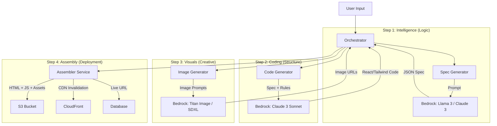

# WebDPro AI - The Perfect Generation Pipeline

> **Architecture Logic**: Based on "The Perfect Structure" for AI Website Builders
> **Core Philosophy**: Pipeline-based generation (Spec → Code → Images → Assemble) rather than single-shot.

---

## 🏗 High-Level Pipeline Architecture



---

## 🧠 Model Roles & Selection

| Role | Preferred Model | Fallback Model | Why? |
|------|-----------------|----------------|------|
| **1. Spec & Logic** | **Claude 3 Sonnet** (Bedrock) | Llama 3 (Bedrock) | Needs high reasoning to convert "veg store" into a diverse product list and proper sitemap. |
| **2. Code Generation** | **Claude 3 Sonnet** (Bedrock) | Claude 3 Haiku | Best-in-class for React/Tailwind generation. Haiku is faster/cheaper for simple components. |
| **3. Image Generation** | **Titan Image G1** (Bedrock) | Stable Diffusion XL | Native AWS integration, good cost/performance ratio for UI visuals. |
| **4. Code Analysis** | **CodeBERT** (Optional) | Rule-based Linting | Useful for ensuring generated code doesn't have syntax errors (future optimization). |

---

## 🔄 Detailed Data Flow

### 1. Input Schema (From User)
```json
{
  "business_name": "Curam",
  "business_type": "grocery",
  "location": "Mumbai",
  "theme_preference": "green",
  "language": "en"
}
```

### 2. Intermediate Spec (AI Output)
```json
{
  "sitemap": ["home", "products", "about"],
  "theme": { "primary": "#10B981", "secondary": "#ECFDF5" },
  "sections": [
    {
      "id": "hero",
      "type": "hero_banner",
      "content": { "headline": "Farm Fresh...", "cta": "Shop Now" },
      "image_prompt": "Fresh vegetables in a wicker basket, cinematic lighting, photorealistic"
    }
  ]
}
```

### 3. Output Asset (Deployment)
```json
{
  "html": "<!DOCTYPE html>...",
  "assets": {
    "hero_image": "https://s3.../hero.jpg"
  },
  "config": {
    "api_endpoint": "https://api.webdpro.in"
  }
}
```

---

## 🛠 Backend Implementation Strategy

We will replace the monolithic `generateSiteContent` with a directed graph pipeline:

1.  **`src/pipeline/1_spec_generator.ts`**:
    - Takes user input.
    - Prompts Claude 3 to return **pure JSON spec**.
    - Validates schema (Zod).

2.  **`src/pipeline/2_code_generator.ts`**:
    - Takes JSON spec.
    - Iterates through sections.
    - Generates React components (headers, grids, footers) using Tailwind.

3.  **`src/pipeline/3_image_generator.ts`**:
    - Scans spec for `image_prompt`.
    - Calls Bedrock (Titan/SDXL).
    - Uploads images to S3.
    - Returns mapped URLs.

4.  **`src/orchestrator.ts`**:
    - Manages the state.
    - Handle retries.
    - Merges Code + Images.

---

## 🔮 Future-Proofing

This "Perfect Structure" allows swapping components easily:
- Want better code? Swap Step 2 model to GPT-4o (if moving off AWS) or next-gen Claude.
- Want better images? Swap Step 3 to Midjourney API (external).
- The **Orchestrator** remains the same.
