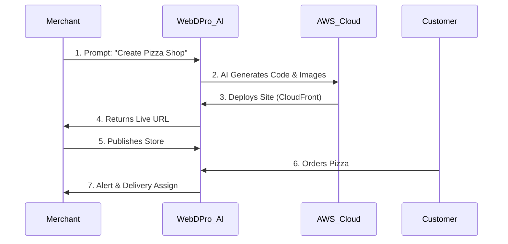
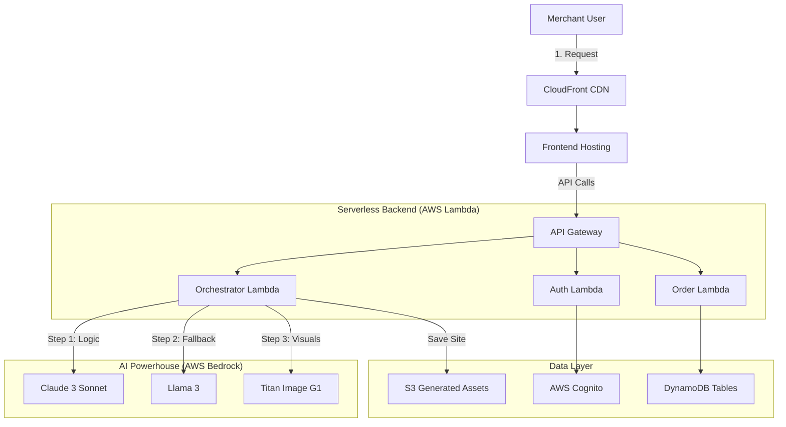

# WebDPro AI - Hackathon Presentation Deck
**Track**: [Professional Track] AI for Retail, Commerce & Market Intelligence

---

## 📅 Slide 1: Project Brief & Vision

### **Project Name**: WebDPro AI
**Tagline**: "From Thought to Store in 5 Minutes."

### **The Idea**
WebDPro AI is an autonomous **"Prompt-to-Commerce" SaaS platform**. It allows any small business owner (retailer, grocer, clinic) to describe their business in plain language (e.g., *"I want a green-themed vegetable store in Mumbai with delivery"*), and our AI agent automatically orchestrates the **generation, coding, deployment, and management** of a fully functional e-commerce website with inventory and delivery systems included.

### **The Problem It Solves**
*   **Retailers are offline**: Millions of SMBs want to go online but can't afford agencies ($2000+) or handle complex DIY builders (Shopify/Wix).
*   **Time-to-Market**: Traditional development takes weeks.
*   **Fragmentation**: They need separate tools for Website + Inventory + Payments + Delivery.0
.0330333333333333333333333333333331

---

## 💡 Slide 2: Uniqueness & USP

### **How is it different?**
| Feature | Traditional Builders (Wix/Shopify) | AI Wrappers (Simple Generators) | **WebDPro AI (Our Solution)** |
| :--- | :--- | :--- | :--- |
| **Creation** | Drag-and-drop (Hours) | Single-page static text | **Full E-commerce w/ Cart & Backend** |
| **Cost** | High monthly fees + plugins | Low Utility | **Pay-as-you-go / Affordable SaaS** |
| **Ecosystem** | Just the website | Just the UI | **Website + Inventory + Delivery App** |

### **How it solves the problem**
*   **Zero-Code**: Uses Generative AI (AWS Bedrock) to write the code, not just text.
*   **Hyper-Local**: AI understands local context (currency, product types, language).
*   **All-in-One**: Generates the *operations* stack, not just the *marketing* page.

### **USP (Unique Selling Proposition)**
1.  **"One Prompt, Full Stack"**: We generate the database schema, inventory, and frontend in one go.
2.  **AI-Resilience Chain**: A 5-level fallback system (Claude -> Titan -> Llama) ensures the service never fails.
3.  **Serverless Scaling**: Built 100% on AWS Serverless (Lambda/DynamoDB) for near-zero idle cost.

---

## ✨ Slide 3: Key Features (Visuals)

*(Suggested Visual: A central phone showing the prompt, surrounded by icons of the generated outputs)*

1.  **🤖 Generative AI Builder**: Creates unique, branded designs (not just templates) using Claude 3 & Titan Image.
2.  **📦 Smart Inventory**: AI pre-fills the inventory based on the store type (e.g., a pharmacy gets 50 common medicines auto-added).
3.  **🚚 Built-in Delivery Logic**: Integrated agent tracking and "Cash on Delivery" management system.
4.  **💳 India-First Payments**: Native UPI & Razorpay integration with split payouts.
5.  **📉 AI Stock Predictions**: Uses Bedrock to analyze sales patterns and predict "Low Stock" alerts.

---

## 🔄 Slide 4: Process Flow Diagram

*(Use this Mermaid diagram in your presentation)*

---

## 🏗️ Slide 5: Architecture Diagram

*(This demonstrates the Robust Professional Track Engineering)*

---

## 📱 Slide 6: Visual Mockups (Descriptions)

*(Include screenshots of these screens)*

1.  **The "Magic Input" Screen**: A clean, dark-mode screen with a single glowing text box: *"What do you want to build today?"*.
2.  **The Generation Loader**: A terminal-style or progress-step UI showing: "Planning Architecture... Writing Code... Generating Images... Deploying...".
3.  **The Dashboard**: A Merchant view showing "Live Orders", "Inventory Health", and "Total Sales".
4.  **The Customer View**: The final generated e-commerce site on a mobile frame (looks professional, not like a template).

---

## 🛠️ Slide 7: Technology Stack

**"Built 100% Native on AWS"**

| Layer | Technology | Usage |
| :--- | :--- | :--- |
| **AI Models** | **AWS Bedrock** (Claude 3, Titan, Llama) | Logic, Code, & Image Generation |
| **Compute** | **AWS Lambda** (Node.js/TypeScript) | Serverless Business Logic |
| **Database** | **Amazon DynamoDB** | Single-table design for multi-tenancy |
| **Storage** | **Amazon S3** | Storing generated HTML/CSS/Assets |
| **Auth** | **Amazon Cognito** | Secure Phone OTP Authentication |
| **Payment** | **Razorpay** | Payment Gateway Integration |
| **Frontend** | **Next.js + Tailwind** | The Dashboard & Generated Sites |

---

## 💰 Slide 8: Implementation Cost & Feasibility

**Estimated Monthly Run Cost (MVP)**: ~$25 - $40 USD
*   **Bedrock**: Pay-per-token (approx $0.05 per website generation).
*   **Lambda/DynamoDB**: Free tier eligible for first ~100k requests.
*   **Hosting**: AWS Amplify/CloudFront (Pay per GB transfer).

**Feasibility**:
*   Uses **Infrastructure-as-Code** (Serverless Framework) for replicable deployment.
*   **High Scability**: Can handle 1000s of simultaneous generations due to serverless concurrency.

---

## ✅ Slide 9: Hackathon Requirements Check

*   **Business Relevance**: Directly empowers the Retail/SMB sector (huge market).
*   **Data-Driven**: Uses AI to predict inventory and stock levels.
*   **Efficiency**: Reduces 2 weeks of dev work to 5 minutes.
*   **Innovation**: Novel use of multi-model AI chaining (Bedrock) to generate functional applications, not just text.
