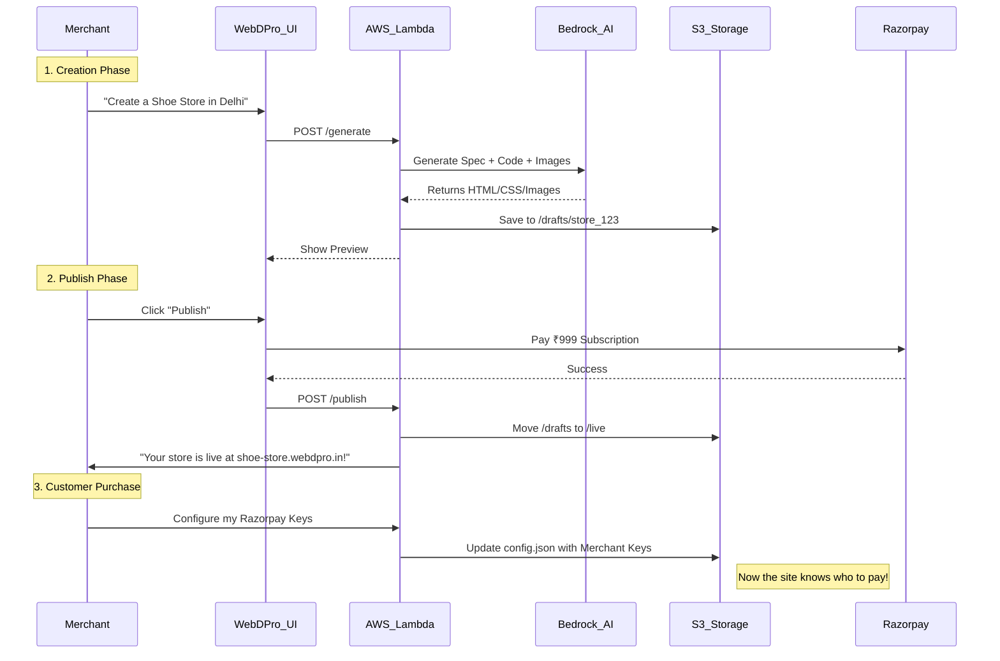

# 🧈 WebDPro AI: How It Actually Works (The Butter-Smooth Guide)

> **For**: Developers, Investors, and Team Members
> **Goal**: Understand the magic under the hood without the headache.

---

## ☁️ The 6 Core AWS Services (The Powerhouse)

We use **Serverless AWS** services. This means we don't manage any servers. AWS handles the heavy lifting, we just write the logic.

### 1. **AWS Bedrock** (The Brain 🧠)
*   **What it does:** It's the home for our AI models. It doesn't "think" on its own but gives us access to smart models.
*   **Our Models:**
    *   **Claude 3 Sonnet:** The "Architect". It plans the website structure and writes the React/Tailwind code.
    *   **Amazon Titan / SDXL:** The "Artist". It paints the hero images and backgrounds based on the business type.
*   **Why?** It's private, secure, and we pay only for what we use.

### 2. **AWS Lambda** (The Workers 👷)
*   **What it does:** These are tiny functions that run only when needed.
*   **Role:** When a user clicks "Generate", a Lambda wakes up, talks to Bedrock, saves files, and goes back to sleep.
*   **Modules:**
    *   `auth` (Login/OTP)
    *   `stores` (AI Generation)
    *   `inventory` (Stock Management)
    *   `delivery` (Agent Tracking)

### 3. **Amazon DynamoDB** (The Memory 📝)
*   **What it does:** A super-fast NoSQL database.
*   **Role:** Stores everything: User profiles, Store configs, Orders, Product lists, and Delivery status.
*   **Why?** It scales to millions of users automatically.

### 4. **Amazon S3** (The Storage 📦)
*   **What it does:** Stores files.
*   **Role:** holds the **generated HTML/CSS/JS files** and **AI-generated images** for every store.
*   **Structure:** `bucket/stores/{storeId}/index.html`

### 5. **Amazon CloudFront** (The Delivery 🚀)
*   **What it does:** A Content Delivery Network (CDN).
*   **Role:** Makes the generated websites load instantly anywhere in the world by caching S3 files closer to the user.

### 6. **Amazon Cognito** (The Bouncer 🔐)
*   **What it does:** Handles security.
*   **Role:** Manages Phone Number OTP logins for Merchants, Customers, and Delivery Agents. No passwords to forget.

---

## 🌐 Connecting Domains (Hostinger)

How does `store-123.webdpro.in` or `my-pizza-shop.com` work?

1.  **Subdomains (`store.webdpro.in`)**:
    *   We own `webdpro.in` on Hostinger.
    *   We point `*.webdpro.in` to our **AWS CloudFront Distribution**.
    *   When a request comes in, AWS Routing rules look at the subdomain and serve the correct folder from **S3**.

2.  **Custom Domains (`pizzashop.com`)**:
    *   Merchant buys domain on Hostinger (via our API or manually).
    *   They add a **CNAME Record** pointing to `cname.webdpro.in`.
    *   Our system detects this and AWS CloudFront serves their specific S3 folder.

---

## 💳 Connecting Payments (Razorpay)

We handle **two types of money flow**. This is critical to understand.

### Flow A: Merchant Pays Platform (Subscription)
*   **Who pays who?** Merchant pays WebDPro.
*   **Why?** To generate/publish their store (e.g., ₹999/month).
*   **How:**
    1.  Merchant clicks "Publish".
    2.  System creates a **Razorpay Order** using **WebDPro's Razorpay Keys**.
    3.  Merchant pays via UPI/Card.
    4.  Webhook confirms payment -> Store goes LIVE.

### Flow B: Customer Pays Merchant (E-commerce)
*   **Who pays who?** Customer pays Merchant (Pizza Shop).
*   **Why?** Buying a pizza.
*   **How:**
    1.  **Onboarding:** When a Merchant joins, they enter their **Razorpay Key ID & Secret** (or we facilitate a simplified "Razorpay Route" onboarding).
    2.  **The Checkout:**
        *   Customer adds Pizza to cart.
        *   The generated website uses the **Merchant's Keys** to open the payment popup.
        *   Customer pays.
        *   Money goes **direct to Merchant's Razorpay account**.
        *   WebDPro gets a webhook to update the Order Status to "PAID".

> **Why this way?** We don't touch the merchant's customer money. It builds trust and simplifies tax compliance.

---

## 🔄 The Complete "Butter-Smooth" Workflow

